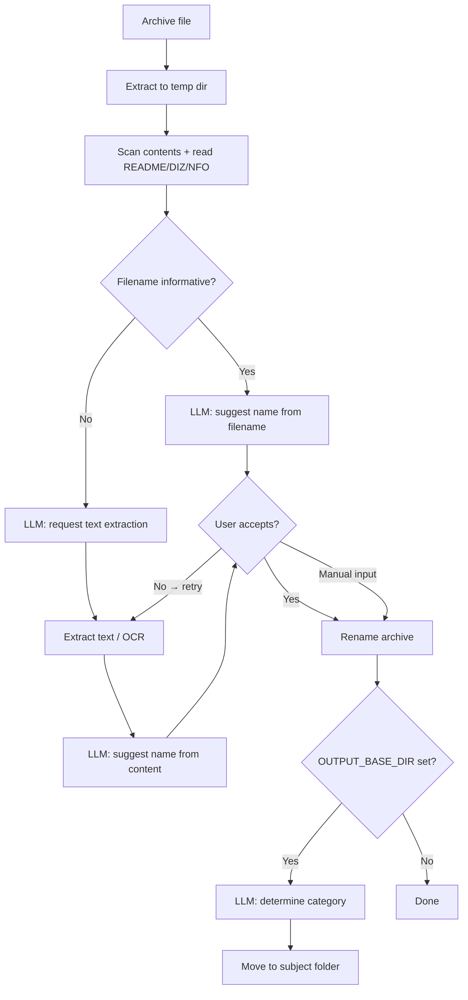

> 🇷🇺 [Читать на русском](README.ru.md)


# 📚 AI Library Renamer

**AI-powered tool for renaming and categorizing book archives using a local LLM (Ollama)**

Automatically identifies book titles inside ZIP/RAR archives — even from garbled filenames, transliteration, or pure noise — and renames them meaningfully. Supports scanned books via OCR. Runs fully offline with Ollama, no API keys or internet required.

---

## ✨ Features

- **Smart renaming** — analyzes archive name, internal filenames, metadata, and file content to determine the real book title
- **Interactive feedback loop** — if the suggested name looks wrong, press `n` and the tool extracts more data and tries again
- **Thematic sorting** — moves renamed archives into subject folders (`Programming - Python`, `Electronics`, `History`, etc.)
- **Fully offline** — works with any local Ollama model, no cloud services
- **OCR support** — extracts text from scanned PDFs and DjVu files via Tesseract
- **Broad format support** — PDF, DjVu, FB2, EPUB, DOCX, MOBI/AZW, TXT, images
- **Batch processing** — process an entire folder of archives in one run

---

## 🔧 Supported Formats

| Format | Text extraction | Metadata |
|--------|----------------|----------|
| PDF | pymupdf (text layer) → OCR fallback | title, author |
| DjVu | djvutxt (text layer) → ddjvu + OCR | djvused |
| FB2 | XML parser | title, author |
| EPUB | OPF/XHTML parser | title, author, publisher |
| DOCX | python-docx | core properties |
| MOBI / AZW | EXTH header parser → mobi package | title, author |
| TXT | direct read | — |
| Images | Tesseract OCR | — |
| ZIP / RAR | content listing + README/DIZ/NFO | — |

---

## 📋 Requirements

**Python 3.9+**

**External tools:**
- [Ollama](https://ollama.com) — local LLM server
- [Tesseract OCR](https://github.com/tesseract-ocr/tesseract/releases) — with `rus` and `eng` language packs
- [DjVuLibre](https://sourceforge.net/projects/djvu/files/DjVuLibre_Windows/) — for DjVu files (`djvutxt`, `ddjvu`)
- [Poppler](https://github.com/oschwartz10612/poppler-windows/releases) — for PDF OCR via pdf2image (Windows)

**Recommended model:** `qwen2.5:14b` (best Cyrillic support), `qwen2.5:7b` for low-RAM systems

---

## 🚀 Installation

```bash
git clone https://github.com/CheshirCa/AI-file-renamer-for-library.git
cd AI-file-renamer-for-library
pip install -r requirements.txt
```

Pull a model in Ollama:
```bash
ollama pull qwen2.5:14b
```

Edit `config.py` to set your model and (optionally) the output directory for sorting:
```python
OLLAMA_MODEL    = "qwen2.5:14b"
OUTPUT_BASE_DIR = r"D:\Books"   # None to disable sorting
```

---

## 💻 Usage

### Rename a single archive
```bash
python main.py --file "076510.rar"
```

### Rename all archives in a folder
```bash
python main.py --dir "D:\Downloads\Books"
```

### Rename and auto-apply without prompts
```bash
python main.py --dir "D:\Downloads\Books" --rename
```

### Rename and move to subject folders
```bash
python main.py --dir "D:\Downloads\Books" --output-dir "D:\Books"
```

### Categorize already-renamed files (no renaming)
```bash
python categorize.py --dir "D:\Books_raw" --output-dir "D:\Books"
python categorize.py --dir "D:\Books_raw" --output-dir "D:\Books" --auto
```

---

## 🖥️ Interactive session example

```
============================================================
[3/131] 013_Shebes_TLEZ_1973.rar
============================================================

  Предлагаемое имя: Shebes - TLEZ 1973.rar
  [y] Принять   [n] Не то, искать дальше   [s] Пропустить   [имя] Ввести своё
  > n
  Ищем дополнительную информацию...
  OCR: извлечено 1437 символов

  Предлагаемое имя: Шебес - Теория линейных электрических цепей.rar
  [y] Принять   [n] Не то, искать дальше   [s] Пропустить   [имя] Ввести своё
  > y

  Категория: Электроника и схемотехника
  Переместить в 'Электроника и схемотехника'? [y/Enter] [n — пропустить] [другое — своя категория]:
  → [Электроника и схемотехника] D:\Books\Электроника и схемотехника\Шебес - Теория линейных электрических цепей.rar
```

---

## ⚙️ Configuration (`config.py`)

| Parameter | Description |
|-----------|-------------|
| `OLLAMA_BASE_URL` | Ollama API address (default: `http://localhost:11434`) |
| `OLLAMA_MODEL` | Model name (e.g. `qwen2.5:14b`) |
| `OLLAMA_TIMEOUT` | Request timeout in seconds |
| `OUTPUT_BASE_DIR` | Base folder for sorted books (`None` to disable) |
| `BOOK_CATEGORIES` | List of subject categories for sorting |

---

## 🗂️ Project Structure

```
├── main.py              — rename + sort, main entry point
├── categorize.py        — sort already-renamed files
├── config.py            — model, paths, categories
├── llm_client.py        — Ollama API client
├── prompts.py           — LLM prompt builders
├── archive_tools.py     — archive extraction and scanning
├── file_tools.py        — document detection and text extraction
└── formats/
    ├── pdf_handler.py   — PDF (pymupdf + OCR fallback)
    ├── djvu_handler.py  — DjVu (djvutxt + ddjvu OCR)
    ├── fb2_handler.py   — FB2
    ├── epub_handler.py  — EPUB
    ├── docx_handler.py  — DOCX/DOC
    ├── mobi_handler.py  — MOBI/AZW (EXTH metadata parser)
    ├── txt_handler.py   — TXT
    ├── image_handler.py — Images (Tesseract OCR)
    └── zip_handler.py   — ZIP/RAR content listing
```

---

## 🔄 How it works




