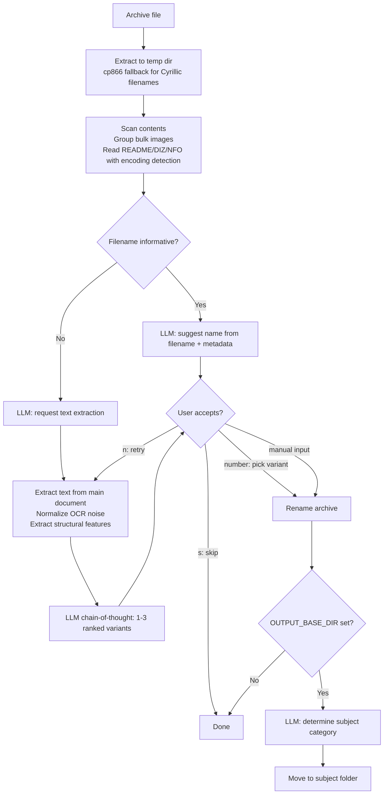

# 📚 AI Library Renamer

> 🇷🇺 [Читать на русском](README.ru.md)

**AI-powered tool for renaming and categorizing book archives using a local LLM (Ollama)**

Automatically identifies book titles inside ZIP/RAR archives — even from garbled filenames, transliteration, encoding corruption, or pure numeric noise — and renames them meaningfully. Supports scanned books via OCR. Runs fully offline with Ollama, no API keys or internet required.

---

## 🆕 What's New

### April 2026 — Major Update

**New format handlers**
- **DOC** (Word 97-2003) — OLE stream extraction via `olefile` → `antiword` → binary grep fallback
- **RTF** — `striprtf` parser with regex fallback; extracts `\title` and `\author` metadata
- **MOBI / AZW / AZW3** — binary EXTH header parser for instant metadata without unpacking; `mobi` package fallback for text extraction

**Smarter text analysis**
- OCR text is now normalized before sending to LLM: hyphenation joined, garbage lines removed, spaces cleaned, pre-reform letters preserved
- Structural features extracted automatically: all-caps lines (likely titles/authors), years, publishers, repeated lines (running headers), pre-reform orthography as dating signal
- LLM now reasons step-by-step (chain-of-thought) and returns 1–3 ranked name variants with confidence and reason; user picks by number
- Prompts rewritten in Russian — better results for Cyrillic titles, Soviet-era books, and transliteration

**Unicode & encoding fixes**
- NFC normalization fixes `й`/`ё` displayed as two characters (macOS artifact common in filenames)
- Transliteration detector distinguishes Russian translit from English text — `Classroom in a Book` stays as-is, `Teoriya Tsepey` becomes `Теория Цепей`
- TXT, DIZ, NFO files now use `charset_normalizer` for encoding detection (UTF-8 / cp1251 / cp866)

**Archive extraction**
- Fallback to direct `rar.exe` / `7z.exe` subprocess when patoolib fails on filenames with Cyrillic characters (cp866 encoding issue on Windows)

**Sorting & categorization**
- `categorize.py` — standalone script to sort already-renamed files into subject folders without renaming
- 47 subject categories with subcategories: `Programming - Python`, `Administration - Linux`, `Electronics & Schematics`, `Fiction - Sci-Fi`, etc.
- `--output-dir` CLI flag overrides `OUTPUT_BASE_DIR` from config without editing the file

**FAR Manager compatibility**
- Both `main.py` and `categorize.py` handle trailing backslash in paths passed via macro substitution

---

## ✨ Features

- **Smart renaming** — analyzes archive name, internal filenames, metadata, and file content to determine the real book title
- **Interactive feedback loop** — if the suggested name looks wrong, press `n` and the tool extracts more data and tries again; enter any text to rename manually
- **Multiple name variants** — LLM suggests 1–3 ranked options with confidence scores; pick by number
- **Thematic sorting** — moves renamed archives into 47 subject folders with subcategories
- **Separate categorizer** — `categorize.py` sorts already-renamed files independently
- **Fully offline** — works with any local Ollama model, no cloud services
- **OCR support** — extracts text from scanned PDFs and DjVu files via Tesseract; normalizes OCR noise before analysis
- **Broad format support** — PDF, DjVu, FB2, EPUB, DOCX, DOC, RTF, MOBI/AZW, TXT, images
- **Encoding detection** — UTF-8, cp1251, cp866 auto-detection for TXT, DIZ, NFO files
- **Batch processing** — process entire folders; bulk image files grouped in prompt to avoid context overflow
- **FAR Manager compatible** — handles trailing backslash in macro-substituted paths

---

## 🔧 Supported Formats

| Format | Text extraction | Metadata |
|--------|----------------|----------|
| PDF | pymupdf (text layer) → PyPDF2 → OCR | title, author |
| DjVu | djvutxt (text layer) → ddjvu + Tesseract OCR | djvused meta |
| FB2 | XML parser | title, author |
| EPUB | OPF/XHTML parser | title, author, publisher |
| DOCX | python-docx | core properties |
| DOC (Word 97-2003) | olefile stream → antiword → binary grep | SummaryInformation |
| RTF | striprtf → regex fallback | `\title`, `\author` |
| MOBI / AZW / AZW3 | EXTH header parser → mobi package | title, author |
| TXT | charset_normalizer auto-detection | — |
| Images | Tesseract OCR (rus+eng) | — |
| ZIP / RAR | content listing + README/DIZ/NFO (auto-encoding) | — |

---

## 📋 Requirements

**Python 3.9+**

**External tools (install separately):**

| Tool | Purpose | Download |
|------|---------|----------|
| [Ollama](https://ollama.com) | Local LLM server | ollama.com |
| [Tesseract OCR](https://github.com/tesseract-ocr/tesseract/releases) | OCR for scanned books — install `rus` + `eng` packs | GitHub |
| [DjVuLibre](https://sourceforge.net/projects/djvu/files/DjVuLibre_Windows/) | DjVu text extraction and rendering | SourceForge |
| [Poppler](https://github.com/oschwartz10612/poppler-windows/releases) | PDF → image conversion for OCR (Windows) | GitHub |
| [Antiword](http://www.winfield.demon.nl/) | Optional: better DOC extraction | winfield.demon.nl |

**Recommended model:** `qwen2.5:14b` — best Cyrillic and transliteration handling.
For systems with limited RAM: `qwen2.5:7b`.

---

## 🚀 Installation

```bash
git clone https://github.com/your-username/ai-library-renamer.git
cd ai-library-renamer
pip install -r requirements.txt
```

Pull a model:
```bash
ollama pull qwen2.5:14b
```

Edit `config.py`:
```python
OLLAMA_MODEL    = "qwen2.5:14b"
OUTPUT_BASE_DIR = r"D:\Books"   # None to disable sorting
```

---

## 💻 Usage

### Rename a single archive
```bash
python main.py --file "076510.rar"
```

### Rename all archives in a folder
```bash
python main.py --dir "D:\Downloads\Books"
```

### Rename and auto-apply without prompts
```bash
python main.py --dir "D:\Downloads\Books" --rename
```

### Rename and move to subject folders
```bash
python main.py --dir "D:\Downloads\Books" --output-dir "D:\Books"
```

### Categorize already-renamed files (no renaming)
```bash
python categorize.py --dir "D:\Books_raw" --output-dir "D:\Books"
python categorize.py --dir "D:\Books_raw" --output-dir "D:\Books" --auto
```

### Enable verbose logging
```bash
python main.py --file "book.rar" --debug
```

---

## 🖥️ Interactive session example

```
============================================================
[3/131] 013_Shebes_TLEZ_1973.rar
============================================================

  Предлагаемое имя: Shebes - TLEZ 1973.rar
  [y] Принять   [n] Не то, искать дальше   [s] Пропустить   [имя] Ввести своё
  > n
  Ищем дополнительную информацию...
  OCR: извлечено 1437 символов

  [1] Шебес - Теория линейных электрических цепей.rar [88%] — найдено на титульном листе
  [2] Шебес - Теория линейных электрических схем.rar [52%] — альтернативное чтение OCR

  Введи номер варианта, [n] искать дальше, [s] пропустить, или своё имя:
  > 1

  Категория: Электроника и схемотехника
  Переместить в 'Электроника и схемотехника'? [y/Enter] [n — пропустить] [другое — своя категория]:
  → [Электроника и схемотехника] D:\Books\Электроника и схемотехника\Шебес - Теория линейных электрических цепей.rar
```

When the LLM exhausts its retry limit, the extracted text fragment is shown for manual input:

```
  Лимит автоматических итераций исчерпан.

  Не удалось определить название: 533816.rar

  Фрагмент текста из '533816.djvu':
  Глава 1. Введение в теорию...

  Введите имя вручную (Enter — пропустить): Иванов - Теория управления.rar
```

---

## ⚙️ Configuration (`config.py`)

| Parameter | Default | Description |
|-----------|---------|-------------|
| `OLLAMA_BASE_URL` | `http://localhost:11434` | Ollama API address |
| `OLLAMA_MODEL` | `qwen2.5:14b` | Model name |
| `OLLAMA_TIMEOUT` | `120` | Request timeout (seconds) |
| `OUTPUT_BASE_DIR` | `None` | Base folder for sorted books; `None` disables sorting |
| `BOOK_CATEGORIES` | 47 categories | Subject categories list, fully customizable |

### Subject categories (default)

- **Programming:** Python, C/C++, Java, JavaScript, .NET, Assembler, Databases, Algorithms, Other
- **Administration:** Linux, Windows/AD, Networking, Security, Virtualization
- **IT general:** AI/ML, Hardware, Operating Systems
- **Electronics & Engineering:** Schematics, Microcontrollers, Radio, Mechanics, Automation, Architecture
- **Sciences:** Mathematics, Physics, Chemistry, Astronomy
- **Economics & Law:** Accounting, Management, Law
- **Humanities:** History, Psychology, Philosophy, Linguistics, Foreign Languages
- **Fiction:** Classics, Sci-Fi/Fantasy, Detective, Other; Children's Literature
- **Misc:** Medicine, Cooking, Humor, Encyclopedias, Misc

---

## 🗂️ Project Structure

```
├── main.py              — rename + sort, main entry point
├── categorize.py        — sort already-renamed files independently
├── config.py            — model, paths, subject categories
├── llm_client.py        — Ollama API client (English system prompt for JSON reliability)
├── prompts.py           — LLM prompt builders in Russian (better for Cyrillic context)
├── archive_tools.py     — archive extraction with cp866 fallback for Cyrillic filenames
├── file_tools.py        — document detection with format priority scoring
├── text_utils.py        — NFC normalization, transliteration detector, filename fixing
└── formats/
    ├── pdf_handler.py   — PDF: pymupdf → PyPDF2 → OCR
    ├── djvu_handler.py  — DjVu: djvutxt → ddjvu + Tesseract
    ├── fb2_handler.py   — FB2: XML parser
    ├── epub_handler.py  — EPUB: OPF/XHTML parser
    ├── docx_handler.py  — DOCX/DOC (new format)
    ├── doc_handler.py   — DOC (Word 97-2003): olefile → antiword → binary grep
    ├── rtf_handler.py   — RTF: striprtf → regex fallback
    ├── mobi_handler.py  — MOBI/AZW: EXTH header parser → mobi package
    ├── txt_handler.py   — TXT: charset_normalizer encoding detection
    ├── image_handler.py — Images: Tesseract OCR
    ├── ocr_utils.py     — OCR normalization, structural feature extraction
    └── zip_handler.py   — ZIP/RAR: content listing
```

---

## 🔄 How it works



---

## 📄 License

MIT
