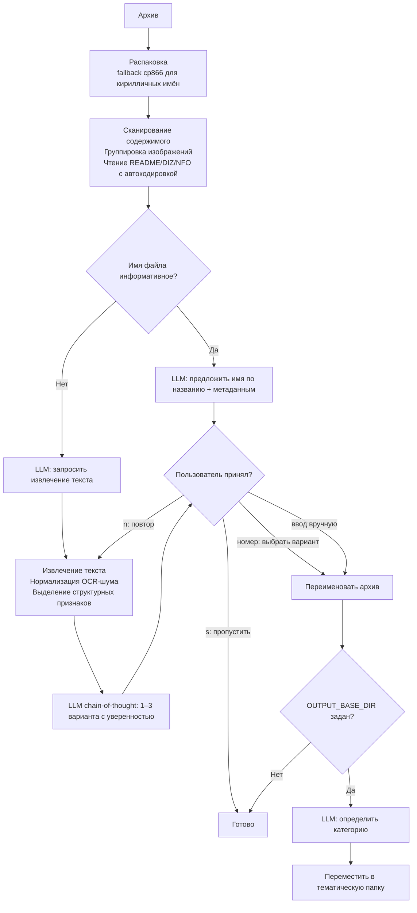

# 📚 AI Library Renamer

> 🇬🇧 [Read in English](README.md)

**Инструмент для переименования и тематической сортировки архивов с книгами с помощью локальной LLM (Ollama)**

Автоматически определяет название книги внутри ZIP/RAR архива — даже если имя файла является случайным набором цифр, транслитом, искажённой кодировкой или полным мусором. Поддерживает сканированные книги через OCR. Работает полностью офлайн через Ollama, без API-ключей и интернета.

---

## 🆕 Что нового

### Апрель 2026 — Крупное обновление

**Новые обработчики форматов**
- **DOC** (Word 97-2003) — извлечение через OLE-стрим (`olefile`) → `antiword` → бинарный поиск строк
- **RTF** — парсер `striprtf` с regex-fallback; извлекает метаданные `\title` и `\author`
- **MOBI / AZW / AZW3** — прямой парсер EXTH-заголовка для мгновенного получения метаданных без распаковки; fallback через пакет `mobi`

**Умнее анализ текста**
- OCR-текст нормализуется перед отправкой в LLM: склейка переносов, удаление мусорных строк, нормализация пробелов, сохранение дореформенных букв
- Автоматически выделяются структурные признаки: строки заглавными буквами (заголовки/авторы), годы, издательства, повторяющиеся строки-колонтитулы, дореформенная орфография как датирующий признак
- LLM рассуждает пошагово (chain-of-thought) и возвращает 1–3 варианта имени с уверенностью и обоснованием; пользователь выбирает по номеру
- Промпты переписаны на русском — лучшие результаты для кириллических названий, советских изданий и транслита

**Исправления Unicode и кодировок**
- NFC-нормализация исправляет `й`/`ё`, хранящиеся как два кодпоинта (артефакт macOS в именах файлов)
- Детектор транслита отличает русский транслит от английского текста — `Classroom in a Book` остаётся без изменений, `Teoriya Tsepey` становится `Теория Цепей`
- TXT, DIZ, NFO файлы теперь используют `charset_normalizer` для автоопределения кодировки (UTF-8 / cp1251 / cp866)

**Распаковка архивов**
- Fallback на прямой вызов `rar.exe` / `7z.exe` через subprocess когда patoolib падает на именах с кириллицей (проблема кодировки cp866 на Windows)

**Сортировка и категоризация**
- `categorize.py` — отдельный скрипт для сортировки уже переименованных файлов по темам без переименования
- 47 тематических категорий с подкатегориями: `Программирование - Python`, `Администрирование - Linux`, `Электроника и схемотехника`, `Художественная литература - Фантастика и фэнтези` и др.
- Флаг `--output-dir` переопределяет `OUTPUT_BASE_DIR` из config без редактирования файла

**Совместимость с FAR Manager**
- `main.py` и `categorize.py` корректно обрабатывают завершающий обратный слэш в путях из макроподстановки

---

## ✨ Возможности

- **Умное переименование** — анализирует имя архива, имена файлов внутри, метаданные и содержимое документа
- **Интерактивная обратная связь** — если предложенное имя неверное, жми `n` и программа извлечёт больше данных; вводи любой текст для ручного переименования
- **Несколько вариантов** — LLM предлагает 1–3 варианта с уверенностью; выбирай по номеру
- **Тематическая сортировка** — перемещает архивы в 47 тематических папок с подкатегориями
- **Отдельный категоризатор** — `categorize.py` раскладывает уже переименованные файлы по темам
- **Полностью офлайн** — без облачных сервисов и API-ключей
- **Поддержка OCR** — с нормализацией шума после Tesseract перед отправкой в LLM
- **Широкая поддержка форматов** — PDF, DjVu, FB2, EPUB, DOCX, DOC, RTF, MOBI/AZW, TXT, изображения
- **Автоопределение кодировки** — UTF-8, cp1251, cp866 для TXT, DIZ, NFO
- **Пакетная обработка** — массивы изображений группируются в промпте чтобы не переполнять контекст
- **Совместимость с FAR Manager** — корректная обработка завершающего слэша

---

## 🔧 Поддерживаемые форматы

| Формат | Извлечение текста | Метаданные |
|--------|------------------|------------|
| PDF | pymupdf (текстовый слой) → PyPDF2 → OCR | название, автор |
| DjVu | djvutxt (текстовый слой) → ddjvu + Tesseract OCR | djvused meta |
| FB2 | XML-парсер | название, автор |
| EPUB | OPF/XHTML-парсер | название, автор, издатель |
| DOCX | python-docx | свойства документа |
| DOC (Word 97-2003) | olefile stream → antiword → бинарный grep | SummaryInformation |
| RTF | striprtf → regex fallback | `\title`, `\author` |
| MOBI / AZW / AZW3 | парсер EXTH-заголовка → пакет mobi | название, автор |
| TXT | charset_normalizer автоопределение кодировки | — |
| Изображения | Tesseract OCR (rus+eng) | — |
| ZIP / RAR | список содержимого + README/DIZ/NFO (автокодировка) | — |

---

## 📋 Требования

**Python 3.9+**

**Внешние инструменты (устанавливаются отдельно):**

| Инструмент | Назначение | Где скачать |
|------------|-----------|-------------|
| [Ollama](https://ollama.com) | Локальный LLM-сервер | ollama.com |
| [Tesseract OCR](https://github.com/tesseract-ocr/tesseract/releases) | OCR для сканов — нужны пакеты `rus` и `eng` | GitHub |
| [DjVuLibre](https://sourceforge.net/projects/djvu/files/DjVuLibre_Windows/) | Извлечение текста и рендеринг DjVu | SourceForge |
| [Poppler](https://github.com/oschwartz10612/poppler-windows/releases) | Конвертация PDF в изображения для OCR (Windows) | GitHub |
| [Antiword](http://www.winfield.demon.nl/) | Опционально: улучшенное извлечение из DOC | winfield.demon.nl |

**Рекомендуемая модель:** `qwen2.5:14b` — лучшая поддержка кириллицы и транслита.
Для систем с малым RAM: `qwen2.5:7b`.

---

## 🚀 Установка

```bash
git clone https://github.com/your-username/ai-library-renamer.git
cd ai-library-renamer
pip install -r requirements.txt
```

Скачать модель:
```bash
ollama pull qwen2.5:14b
```

Отредактировать `config.py`:
```python
OLLAMA_MODEL    = "qwen2.5:14b"
OUTPUT_BASE_DIR = r"D:\Книги"   # None — отключить сортировку
```

---

## 💻 Использование

### Переименовать один архив
```bash
python main.py --file "076510.rar"
```

### Переименовать все архивы в папке
```bash
python main.py --dir "D:\Загрузки\Книги"
```

### Переименовать автоматически без вопросов
```bash
python main.py --dir "D:\Загрузки\Книги" --rename
```

### Переименовать и разложить по тематическим папкам
```bash
python main.py --dir "D:\Загрузки\Книги" --output-dir "D:\Книги"
```

### Разложить уже переименованные файлы по темам (без переименования)
```bash
python categorize.py --dir "D:\Книги_сырые" --output-dir "D:\Книги"
python categorize.py --dir "D:\Книги_сырые" --output-dir "D:\Книги" --auto
```

### Подробный вывод для диагностики
```bash
python main.py --file "book.rar" --debug
```

---

## 🖥️ Пример интерактивной сессии

```
============================================================
[3/131] 013_Shebes_TLEZ_1973.rar
============================================================

  Предлагаемое имя: Shebes - TLEZ 1973.rar
  [y] Принять   [n] Не то, искать дальше   [s] Пропустить   [имя] Ввести своё
  > n
  Ищем дополнительную информацию...
  OCR: извлечено 1437 символов

  [1] Шебес - Теория линейных электрических цепей.rar [88%] — найдено на титульном листе
  [2] Шебес - Теория линейных электрических схем.rar [52%] — альтернативное чтение OCR

  Введи номер варианта, [n] искать дальше, [s] пропустить, или своё имя:
  > 1

  Категория: Электроника и схемотехника
  Переместить в 'Электроника и схемотехника'? [y/Enter] [n — пропустить] [другое — своя категория]:
  → [Электроника и схемотехника] D:\Книги\Электроника и схемотехника\Шебес - Теория линейных электрических цепей.rar
```

Когда LLM исчерпывает лимит попыток, программа показывает фрагмент текста для ручного ввода:

```
  Лимит автоматических итераций исчерпан.

  Не удалось определить название: 533816.rar

  Фрагмент текста из '533816.djvu':
  Глава 1. Введение в теорию...

  Введите имя вручную (Enter — пропустить): Иванов - Теория управления.rar
```

---

## ⚙️ Настройка (`config.py`)

| Параметр | По умолчанию | Описание |
|----------|-------------|----------|
| `OLLAMA_BASE_URL` | `http://localhost:11434` | Адрес API Ollama |
| `OLLAMA_MODEL` | `qwen2.5:14b` | Название модели |
| `OLLAMA_TIMEOUT` | `120` | Таймаут запроса в секундах |
| `OUTPUT_BASE_DIR` | `None` | Базовая папка для сортировки; `None` — отключить |
| `BOOK_CATEGORIES` | 47 категорий | Список тем, полностью настраивается |

### Тематические категории (по умолчанию)

- **Программирование:** Python, C/C++, Java, JavaScript, .NET, Assembler, Базы данных, Алгоритмы, Прочие языки
- **Администрирование:** Linux, Windows/AD, Сети, Безопасность, Виртуализация
- **IT общее:** ИИ/ML, Аппаратное обеспечение, Операционные системы
- **Электроника и инженерия:** Схемотехника, Микроконтроллеры, Радиотехника, Механика, Автоматика, Архитектура
- **Науки:** Математика, Физика, Химия, Астрономия
- **Экономика и право:** Бухгалтерия, Менеджмент, Право
- **Гуманитарные:** История, Психология, Философия, Языкознание, Иностранные языки
- **Художественная:** Классика, Фантастика/Фэнтези, Детектив, Прочее; Детская литература
- **Прочее:** Медицина, Кулинария, Юмор, Энциклопедии, Разное

---

## 🗂️ Структура проекта

```
├── main.py              — переименование + сортировка, точка входа
├── categorize.py        — самостоятельная сортировка по темам
├── config.py            — модель, пути, тематические категории
├── llm_client.py        — клиент Ollama (system prompt на английском для надёжного JSON)
├── prompts.py           — промпты на русском (лучше для кириллического контекста)
├── archive_tools.py     — распаковка с fallback на cp866 для кирилличных имён
├── file_tools.py        — выбор документа с учётом приоритета форматов
├── text_utils.py        — NFC-нормализация, детектор транслита, исправление имён
└── formats/
    ├── pdf_handler.py   — PDF: pymupdf → PyPDF2 → OCR
    ├── djvu_handler.py  — DjVu: djvutxt → ddjvu + Tesseract
    ├── fb2_handler.py   — FB2: XML-парсер
    ├── epub_handler.py  — EPUB: OPF/XHTML-парсер
    ├── docx_handler.py  — DOCX/DOC (новый формат)
    ├── doc_handler.py   — DOC (Word 97-2003): olefile → antiword → бинарный grep
    ├── rtf_handler.py   — RTF: striprtf → regex fallback
    ├── mobi_handler.py  — MOBI/AZW: парсер EXTH → пакет mobi
    ├── txt_handler.py   — TXT: charset_normalizer автоопределение кодировки
    ├── image_handler.py — Изображения: Tesseract OCR
    ├── ocr_utils.py     — нормализация OCR-текста, извлечение структурных признаков
    └── zip_handler.py   — ZIP/RAR: список содержимого
```

---

## 🔄 Как это работает



---

## 📄 Лицензия

MIT
