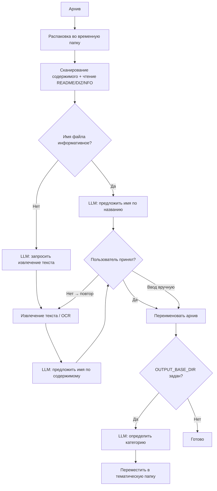

# 📚 AI Library Renamer

**Инструмент для переименования и тематической сортировки архивов с книгами с помощью локальной LLM (Ollama)**

Автоматически определяет название книги внутри ZIP/RAR архива — даже если имя файла — случайный набор цифр, транслит или кракозябры. Поддерживает сканированные книги через OCR. Работает полностью офлайн через Ollama, без API-ключей и интернета.

---

## ✨ Возможности

- **Умное переименование** — анализирует имя архива, имена файлов внутри, метаданные и содержимое документа для определения реального названия книги
- **Интерактивная обратная связь** — если предложенное имя неверное, нажми `n` и программа извлечёт больше данных и попробует снова
- **Тематическая сортировка** — перемещает переименованные архивы в тематические папки (`Программирование - Python`, `Электроника и схемотехника`, `История` и др.)
- **Полностью офлайн** — работает с любой локальной моделью Ollama, без облачных сервисов
- **Поддержка OCR** — извлекает текст из сканированных PDF и DjVu через Tesseract
- **Широкая поддержка форматов** — PDF, DjVu, FB2, EPUB, DOCX, MOBI/AZW, TXT, изображения
- **Пакетная обработка** — обрабатывает всю папку с архивами за один запуск

---

## 🔧 Поддерживаемые форматы

| Формат | Извлечение текста | Метаданные |
|--------|------------------|------------|
| PDF | pymupdf (текстовый слой) → OCR fallback | название, автор |
| DjVu | djvutxt (текстовый слой) → ddjvu + OCR | djvused |
| FB2 | XML-парсер | название, автор |
| EPUB | OPF/XHTML-парсер | название, автор, издатель |
| DOCX | python-docx | свойства документа |
| MOBI / AZW | парсер EXTH-заголовка → пакет mobi | название, автор |
| TXT | прямое чтение | — |
| Изображения | Tesseract OCR | — |
| ZIP / RAR | список содержимого + README/DIZ/NFO | — |

---

## 📋 Требования

**Python 3.9+**

**Внешние инструменты:**
- [Ollama](https://ollama.com) — локальный LLM-сервер
- [Tesseract OCR](https://github.com/tesseract-ocr/tesseract/releases) — с языковыми пакетами `rus` и `eng`
- [DjVuLibre](https://sourceforge.net/projects/djvu/files/DjVuLibre_Windows/) — для DjVu файлов (`djvutxt`, `ddjvu`)
- [Poppler](https://github.com/oschwartz10612/poppler-windows/releases) — для OCR PDF через pdf2image (Windows)

**Рекомендуемая модель:** `qwen2.5:14b` (лучшая поддержка кириллицы), `qwen2.5:7b` для систем с малым количеством RAM

---

## 🚀 Установка

```bash
git clone https://github.com/CheshirCa/AI-file-renamer-for-library.git
cd AI-file-renamer-for-library
pip install -r requirements.txt
```

Скачать модель в Ollama:
```bash
ollama pull qwen2.5:14b
```

Отредактировать `config.py` — указать модель и (опционально) папку для сортировки:
```python
OLLAMA_MODEL    = "qwen2.5:14b"
OUTPUT_BASE_DIR = r"D:\Книги"   # None — отключить сортировку
```

---

## 💻 Использование

### Переименовать один архив
```bash
python main.py --file "076510.rar"
```

### Переименовать все архивы в папке
```bash
python main.py --dir "D:\Загрузки\Книги"
```

### Переименовать автоматически без вопросов
```bash
python main.py --dir "D:\Загрузки\Книги" --rename
```

### Переименовать и разложить по тематическим папкам
```bash
python main.py --dir "D:\Загрузки\Книги" --output-dir "D:\Книги"
```

### Разложить уже переименованные файлы по темам (без переименования)
```bash
python categorize.py --dir "D:\Книги_сырые" --output-dir "D:\Книги"
python categorize.py --dir "D:\Книги_сырые" --output-dir "D:\Книги" --auto
```

---

## 🖥️ Пример интерактивной сессии

```
============================================================
[3/131] 013_Shebes_TLEZ_1973.rar
============================================================

  Предлагаемое имя: Shebes - TLEZ 1973.rar
  [y] Принять   [n] Не то, искать дальше   [s] Пропустить   [имя] Ввести своё
  > n
  Ищем дополнительную информацию...
  OCR: извлечено 1437 символов

  Предлагаемое имя: Шебес - Теория линейных электрических цепей.rar
  [y] Принять   [n] Не то, искать дальше   [s] Пропустить   [имя] Ввести своё
  > y

  Категория: Электроника и схемотехника
  Переместить в 'Электроника и схемотехника'? [y/Enter] [n — пропустить] [другое — своя категория]:
  → [Электроника и схемотехника] D:\Книги\Электроника и схемотехника\Шебес - Теория линейных электрических цепей.rar
```

---

## ⚙️ Настройка (`config.py`)

| Параметр | Описание |
|----------|----------|
| `OLLAMA_BASE_URL` | Адрес API Ollama (по умолчанию: `http://localhost:11434`) |
| `OLLAMA_MODEL` | Название модели (например `qwen2.5:14b`) |
| `OLLAMA_TIMEOUT` | Таймаут запроса в секундах |
| `OUTPUT_BASE_DIR` | Базовая папка для сортированных книг (`None` — отключить) |
| `BOOK_CATEGORIES` | Список тематических категорий для сортировки |

---

## 🗂️ Структура проекта

```
├── main.py              — переименование + сортировка, точка входа
├── categorize.py        — сортировка уже переименованных файлов
├── config.py            — модель, пути, категории
├── llm_client.py        — клиент Ollama API
├── prompts.py           — генераторы промптов для LLM
├── archive_tools.py     — распаковка и сканирование архивов
├── file_tools.py        — определение документа и извлечение текста
└── formats/
    ├── pdf_handler.py   — PDF (pymupdf + OCR fallback)
    ├── djvu_handler.py  — DjVu (djvutxt + ddjvu OCR)
    ├── fb2_handler.py   — FB2
    ├── epub_handler.py  — EPUB
    ├── docx_handler.py  — DOCX/DOC
    ├── mobi_handler.py  — MOBI/AZW (парсер EXTH метаданных)
    ├── txt_handler.py   — TXT
    ├── image_handler.py — Изображения (Tesseract OCR)
    └── zip_handler.py   — Список содержимого ZIP/RAR
```

---

## 🔄 Как это работает



---

## 📄 Лицензия

MIT
